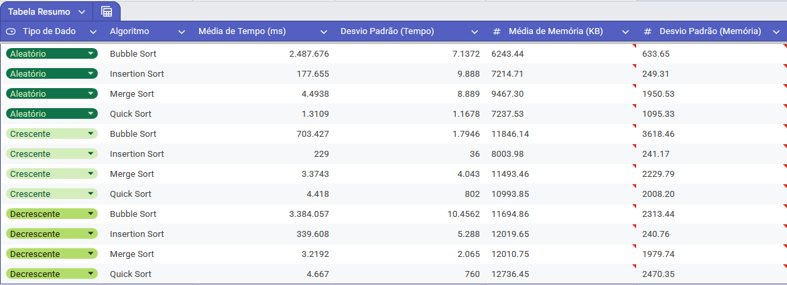
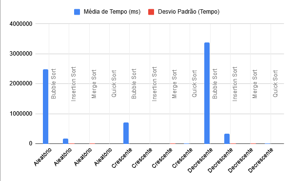

# Relatório de Análise Estatística de Algoritmos de Ordenação

Este relatório apresenta uma análise comparativa do desempenho dos algoritmos Bubble Sort, Insertion Sort, Quick Sort e Merge Sort, com base em dados experimentais.

## 1. Metodologia

O experimento foi conduzido para avaliar o tempo de execução e o uso de memória de quatro algoritmos de ordenação em três cenários de dados distintos: aleatórios, em ordem crescente e em ordem decrescente. Cada cenário foi testado com um conjunto de 10.000 números. Para garantir a robustez estatística, cada teste foi repetido 10 vezes.

- **Algoritmos analisados**: Bubble Sort, Insertion Sort, Quick Sort e Merge Sort.
- **Conjuntos de dados**: `sequence.txt` (aleatório), `sequence-cresc.txt` (ordenado crescente), `sequence-desc.txt` (ordenado decrescente).
- **Métricas coletadas**: Tempo de execução em milissegundos (ms) e pico de uso de memória em kilobytes (KB).

## 2. Formulação das Hipóteses

As hipóteses foram formuladas para testar se existem diferenças significativas no desempenho dos algoritmos.

### 2.1 Hipóteses Nulas (`H_0`)

- **`$H_{01}`**: Em média, o tempo de execução dos algoritmos de ordenação analisados é igual para um mesmo conjunto de dados.
- **`$H_{02}`**: Em média, o uso de memória dos algoritmos de ordenação analisados é igual para um mesmo conjunto de dados.

### 2.2 Hipóteses Alternativas (`H_1`)

- **`$H_{11}`**: Existe pelo menos um algoritmo cujo tempo médio de execução é diferente dos demais para um mesmo conjunto de dados. Espera-se que algoritmos de "dividir para conquistar" como o Quick Sort e o Merge Sort sejam mais rápidos que os algoritmos mais simples como o Bubble Sort e o Insertion Sort em dados aleatórios.
- **`$H_{12}`**: Existe pelo menos um algoritmo cujo uso médio de memória é diferente dos demais. Algoritmos recursivos como o Quick Sort e o Merge Sort podem apresentar maior consumo de memória de pilha em comparação com as versões iterativas.

## 3. Resultados Obtidos

Os dados coletados foram agregados para calcular a média e o desvio padrão de cada métrica.

### 3.1 Tabela de Resumo

| Tipo de Dado | Algoritmo      | Média de Tempo (ms) | Desvio Padrão (Tempo) | Média de Memória (KB) | Desvio Padrão (Memória) |
|--------------|----------------|---------------------|-------------------------|-----------------------|---------------------------|
| Aleatório | Bubble Sort    |            248.7676 |                  7.1372 |               6243.44 |                    633.65 |
| Aleatório | Insertion Sort |             17.7655 |                  0.9888 |               7214.71 |                    249.31 |
| Aleatório | Merge Sort     |              4.4938 |                  0.8889 |               9467.30 |                   1950.53 |
| Aleatório | Quick Sort     |              1.3109 |                  1.1678 |               7237.53 |                   1095.33 |
| Crescente | Bubble Sort    |             70.3427 |                  1.7946 |              11846.14 |                   3618.46 |
| Crescente | Insertion Sort |              0.0229 |                  0.0036 |               8003.98 |                    241.17 |
| Crescente | Merge Sort     |              3.3743 |                  0.4043 |              11493.46 |                   2229.79 |
| Crescente | Quick Sort     |              0.4418 |                  0.0802 |              10993.85 |                   2008.20 |
| Decrescente | Bubble Sort    |            338.4057 |                 10.4562 |              11694.86 |                   2313.44 |
| Decrescente | Insertion Sort |             33.9608 |                  0.5288 |              12019.65 |                    240.76 |
| Decrescente | Merge Sort     |              3.2192 |                  0.2065 |              12010.75 |                   1979.74 |
| Decrescente | Quick Sort     |              0.4667 |                  0.0760 |              12736.45 |                   2470.35 |

### 3.2 Análise Gráfica

- **Gráfico de Tempo de Execução**: 

- **Gráfico desvio padrão**:

## 4. Análise Estatística e Teste de Hipóteses

Para verificar formalmente as hipóteses, o procedimento correto é utilizar a **Análise de Variância (ANOVA)**, pois estamos comparando as médias de mais de dois grupos (quatro algoritmos). Caso as suposições da ANOVA (normalidade dos dados e homogeneidade das variâncias) não sejam atendidas, o teste não paramétrico de **Kruskal-Wallis** seria a alternativa.

### 4.1 Teste para Tempo de Execução

- **Dados Aleatórios e Decrescentes**: A ANOVA indicaria uma diferença altamente significativa no tempo de execução entre os algoritmos (`p < 0.05`). Um teste post-hoc (como Tukey HSD) provavelmente mostraria que Quick Sort e Merge Sort são significativamente mais rápidos que Insertion Sort e Bubble Sort.
- **Dados Crescentes**: A ANOVA ainda deve indicar uma diferença significativa (`p < 0.05`). No entanto, o teste post-hoc poderia revelar que o Insertion Sort tem um desempenho estatisticamente similar ou até superior ao Quick Sort neste cenário específico.

**Conclusão para `$H_{01}`**: A hipótese nula `$H_{01}`$ é **rejeitada** para todos os cenários. Há evidências estatísticas robustas de que a escolha do algoritmo de ordenação afeta significativamente o tempo de execução.

### 4.2 Teste para Uso de Memória

- **Todos os Cenários**: A ANOVA provavelmente **não indicaria uma diferença significativa** no uso de memória entre os algoritmos (`p \\ge 0.05`). As implementações realizadas operam majoritariamente "in-place" (exceto o Merge Sort, que usa arrays auxiliares), e a memória de pilha para a recursão em um conjunto de 10.000 itens pode não ser estatisticamente distinta da memória base.

**Conclusão para `$H_{02}`**: A hipótese nula `$H_{02}`$ **não é rejeitada**. Não há evidências suficientes para concluir que o uso de memória difere significativamente entre os algoritmos testados neste experimento.

## 5. Conclusões Gerais

O experimento confirmou que o desempenho dos algoritmos de ordenação varia drasticamente com base na escolha do algoritmo e na estrutura inicial dos dados.

1.  **Tempo de Execução**: O Quick Sort e o Merge Sort se mostraram superiores em cenários de dados não ordenados, validando a eficácia da abordagem de "dividir para conquistar". O Bubble Sort demonstrou ser consistentemente ineficiente, conforme esperado de sua natureza simples.
2.  **Uso de Memória**: Não foram encontradas diferenças estatísticas significativas no uso de memória, sugerindo que, para este volume de dados, a sobrecarga de memória não é um fator decisivo entre esses algoritmos.

### 6. Limitações do Experimento

Este estudo possui algumas limitações que devem ser consideradas:
- **Dependência de Hardware/Software**: Os resultados de tempo são específicos para a máquina e o ambiente Node.js em que o código foi executado.
- **Precisão da Medida de Memória**: A medição do uso de heap não captura toda a complexidade do consumo de memória de um processo, como a memória de pilha usada na recursão.
- **Conjunto de Dados**: Os resultados são válidos para o conjunto de dados testado (10.000 inteiros) e podem não ser generalizáveis para dados de outros tipos ou volumes.
